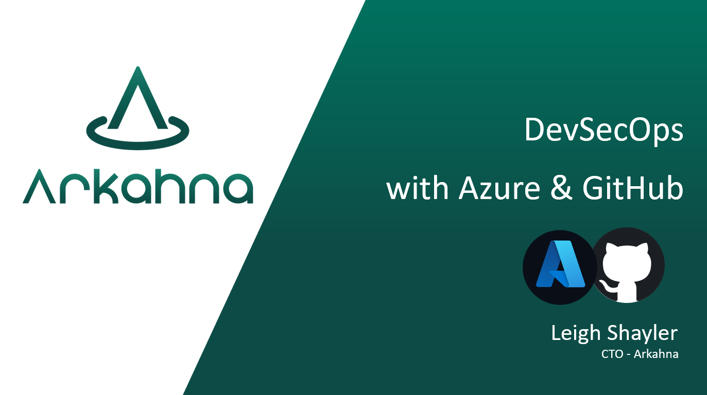

# Perth Microsoft Security Meetup

- [June 2021](#June-2021:-Design-for-Network-Security-&-Containment)
- [July 2021](#July-2021:-DevSecOps-with-Azure-and-GitHub)
- [August 2021](#August-2021:-Sensitive-Info-Types-&-MIP)

---
The Perth Microsoft Security Meetup is a meeting place for anyone with an interest in the Microsoft Security ecosystem. Whether your focus is on Microsoft 365, Azure or hybrid security across on-premises and cloud, this user group brings together like minded individuals from both customers and Microsoft partners.

The aim is to run monthly meetups (in person when COVID allows us or online) for speakers to present on various security related topics and capabilities within the Microsoft security portfolio.

Please visit our [Code of Conduct](https://arkahna.io/perth-microsoft-security-meetup-code-of-conduct/) page that outlines our expectations for participants within the Perth Microsoft Security Meetup as well as our commitment to inclusion and creating a safe environment for all members.

Slides from the previous sessions can be found below:

## June 2021: Design for Network Security & Containment

Network security has been the traditional linchpin of enterprise security efforts, however, cloud computing has increased the requirement for network perimeters to be more permeable. Whilst network security is no longer the primary focus for securing cloud assets it is still needed for legacy assets

## July 2021: DevSecOps with Azure and GitHub

DevOps is a set of methodologies (people, process, and tools) that enable teams to ship better code, faster. One of the principles of DevOps is to “shift-left” in the software development lifecycle and shift activities such as testing closer to development to help tighten the feedback loop and find and resolve bugs sooner.

DevSecOps is an extension of DevOps and seeks to embed and “shift-left” application security practices within your software development lifecycle.

In this session we will cover quick wins you can bake into your existing DevOps environment to help detect and prevent vulnerabilities from being deployed into your web applications.

## August 2021: Sensitive Info Types & MIP

Sensitive Info Type’s (SIT’s) are the foundational component that makes DLP possible, it’s also the key to Microsoft Information Protection (MIP) as well as Insider Risk, Communications and Compliance.
Join us for a session where we unpack some of the deeper details on SIT’s, how they work, and how to get started in your environment - this is a work in progress, so please bring your questions & scenarios.
